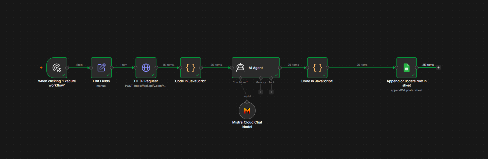
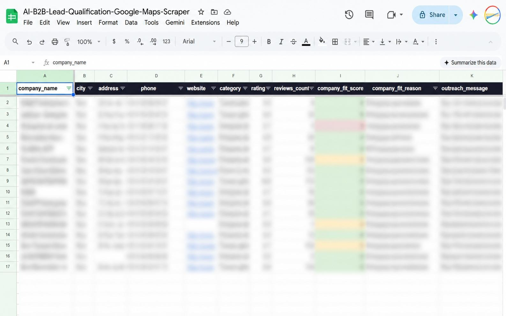

# AI B2B Lead Qualification & Google Maps Scraper

An n8n automation that finds local B2B leads from Google Maps through Apify, qualifies each business with Mistral AI, generates a personalized outreach opener, and saves the results into Google Sheets.

> Built with **n8n - Apify - Mistral AI - Google Sheets**

## Project Assets

- [n8n workflow export](workflow.json) - credential-free workflow template
- [Setup guide](docs/SETUP.md) - step-by-step rebuild and import instructions
- [Workflow export checklist](docs/WORKFLOW_EXPORT_CHECKLIST.md) - safety checklist before publishing exports
- [Sample lead output](sample-data/sample-leads.csv) - fabricated example output
- [Workflow screenshot](screenshots/workflow-overview.png) - n8n canvas overview
- [Google Sheets output screenshot](screenshots/google-sheets-output.jpg) - blurred sheet output preview

> **Workflow note:** `workflow.json` is a scrubbed public export. Replace the `YOUR_...` placeholders with your own Apify token, Google Sheet ID, tab ID, and n8n credentials after importing.

---

## What It Does

This workflow turns a simple target search into a lead sheet:

```text
Manual trigger
  -> Set city, sector keyword, country, max results
  -> Call Apify Google Maps scraper
  -> Clean business fields
  -> Ask Mistral AI to qualify each company
  -> Parse AI JSON output
  -> Append or update rows in Google Sheets
```

For each business, the sheet stores:

- company name
- city
- address
- phone
- email, when available
- website
- category
- Google rating
- review count
- AI company fit score
- AI company fit reason
- outreach message
- lead status

---

## Who This Helps

This is useful for freelancers, agencies, SaaS teams, consultants, and local service providers who need a repeatable way to build prospect lists without manually checking each Google Maps result.

| Sector | Example search |
| --- | --- |
| Construction | `roofers London` |
| Real estate | `real estate agencies Dubai` |
| Healthcare | `dental clinics New York` |
| Hospitality | `restaurants Paris` |
| IT services | `software companies Berlin` |
| Beauty and wellness | `spas Los Angeles` |
| Automotive | `garages Manchester` |

If a business has a Google Maps listing, this workflow can collect it, score it, and prepare first-touch outreach.

---

## Workflow Overview



---

## Output Preview



The screenshot uses blurred lead rows. Do not publish real prospect data, phone numbers, emails, or private customer lists.

---

## Google Sheet Columns

Create a sheet tab with these headers in row 1:

```text
company_name | city | address | phone | email | website | category | rating | reviews_count | company_fit_score | company_fit_reason | outreach_message | status
```

The workflow uses `company_name` as the match key for append-or-update behavior. Running the same search again updates the existing row instead of creating a duplicate.

---

## Setup

### Requirements

- n8n Cloud or self-hosted n8n
- Apify account and API token
- Mistral AI API key
- Google account with Sheets access

### Import

1. Open n8n.
2. Create a new workflow.
3. Import `workflow.json`.
4. Add your Mistral and Google Sheets credentials.
5. Replace the Apify token placeholder in the HTTP Request node URL.
6. Select your Google Sheet and tab in the final Google Sheets node.

### Configure Search

In the `Edit Fields` node, set:

| Field | Example |
| --- | --- |
| `city` | `London` |
| `sector_keyword` | `dentist` |
| `max_results` | `25` |
| `country` | `GB` |

The HTTP Request node uses those values to call the Apify Google Maps actor.

---

## Security Notes

- The public workflow uses placeholders, not live tokens.
- Do not commit real Apify tokens, Mistral API keys, Google credential IDs, or private Google Sheet IDs.
- The sheet screenshot is blurred because lead data can include phone numbers, websites, and business contact details.
- Review any newly exported n8n workflow before publishing it.

---

## What This Project Demonstrates

- API-driven Google Maps lead scraping with Apify
- AI lead scoring with Mistral
- Structured JSON parsing inside n8n Code nodes
- Google Sheets used as a lightweight CRM
- Deduplication through append-or-update by `company_name`
- Public-safe workflow publishing with placeholders

---

## Roadmap

- Add multi-city batch mode
- Add scheduled weekly runs
- Add email enrichment through a third-party enrichment API
- Send high-fit leads to Slack or email
- Push qualified leads into HubSpot, Pipedrive, or Notion

---

## License

MIT - free to use, modify, and share.

---

## Author

Built by **Akshay**.
